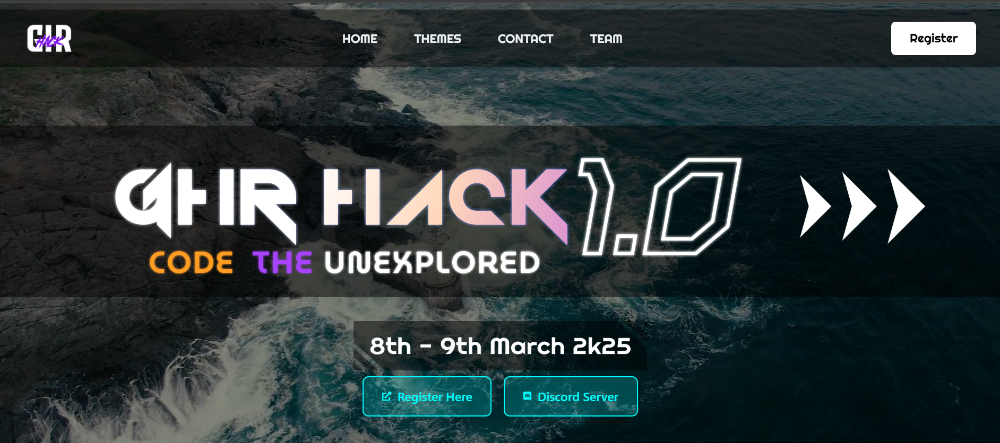

# GHR Hack 1.0

Welcome to the official website of **GHR Hack 1.0** .This website serves as the central hub for all information related to the event, showcasing event details, schedules, and more.




## 🌐 Live Link
Access the website here: [GHR Hack 1.0](https://ghr-hack-1-0.vercel.app/)

## 🛠️ Technologies Used

- **Frontend Framework:** React.js
- **Styling:** Tailwind,Css
- **Version Control:** Git and GitHub

## 📂 Project Structure

```
GHR-Hack-1-0
├── public            # Public assets like images and favicon
├── src
│   ├── assets        # Static images and other assets
│   ├── components    # Reusable React components
│   ├── pages         # Page components for routing
│   ├── styles        # CSS files or styled-components
│   └── App.js        # Main application file
├── .gitignore        # Files and folders to be ignored by Git
├── package.json      # Project metadata and dependencies
├── README.md         # Documentation file
└── vercel.json       # Vercel-specific configuration (if applicable)
```


## 💻 Installation and Setup

1. Clone the repository:
   ```bash
   git clone https://github.com/your-username/GHR-Hack-1-0.git
   ```

2. Navigate to the project directory:
   ```bash
   cd GHR-Hack-1-0
   ```

3. Install dependencies:
   ```bash
   npm install
   ```

4. Start the development server:
   ```bash
   npm run dev
   ```


## 🤝 Contributing

We welcome contributions! To contribute to this project:

1. Fork the repository.
2. Create a new branch:
   ```bash
   git checkout -b feature-name
   ```
3. Make your changes and commit them:
   ```bash
   git commit -m "Add feature-name"
   ```
4. Push to the branch:
   ```bash
   git push origin feature-name
   ```
5. Open a pull request on GitHub.

---

## 🛡️ License

This project is licensed under the [MIT License](LICENSE).

## 📞 Contact

For any inquiries or support, please contact:
- **Email:** Mrsidharth2004@gmail.com
- **GitHub:** [Unstopablesid](https://github.com/unstopablesid)
- **Website:** [GHR Hack 1.0](https://ghr-hack-1-0.vercel.app/)

---

Thank you for visiting the GHR Hack 1.0 website!

